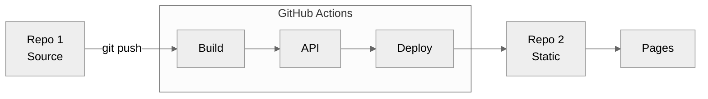

This repo hosts the static files built from source codes written in Jekyll (Ruby).

```mermaid
%%{init: {'theme':'neutral'}}%%
graph LR
    A[Repo 1<br/>Source]
    subgraph "GitHub Actions"
        B[Build] --> C[API] --> D[Deploy]
    end
    E[Repo 2<br/>Static] --> F[Pages]

    A -->|git push| B
    D --> E
```

---

~ design inspiration
- style: https://www.katmh.com/
- gallery: https://joshuahhh.com/index-2020.html
